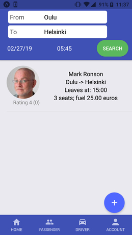

# Kimppakyyti: Ridesharing prototype
This is a ridesharing prototype I made to develop my skills in React native and DRF.
Client can be found in "react-native-client"-folder and backend in "backend" - folder. Insctructions to run can be found in corresponding folders.

## Main page

## [Demo video: Filtering rides. Sending and undoing a ride request.](https://www.youtube.com/watch?v=Pgm3KBHFIWs&feature=youtu.be)

## Technologies
- React Native
- Nativebase
- Django Rest Framework

## TODO
- view for client posting rides
- client tests
- login
- better way to handle state in client (redux?)
- ...
